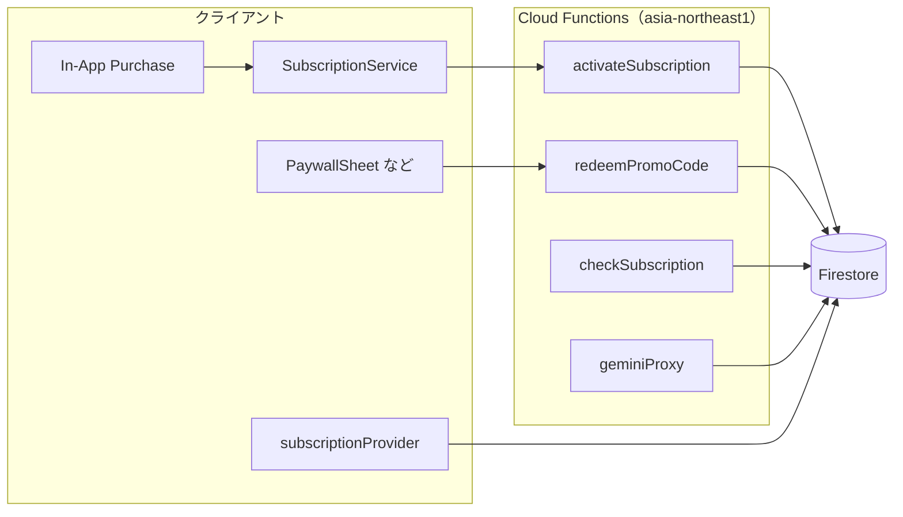

# サブスクリプションとプロモコード — 実装・セットアップガイド

このドキュメントは **Firebase / Flutter / Cloud Functions 側** の設定と、**課金・プロモコードがアプリ内でどう処理されるか** をまとめた開発者向けガイドです。

ストア（App Store Connect / Google Play Console）での商品登録や運用ノウハウは、別紙 **[サブスクリプション設定ガイド](./サブスクリプション設定ガイド.md)** を参照してください。

---

## 目次

1. [全体の流れ](#1-全体の流れ)
2. [前提となる Firebase 構成](#2-前提となる-firebase-構成)
3. [Flutter アプリの設定ポイント](#3-flutter-アプリの設定ポイント)
4. [Cloud Functions のデプロイと環境変数](#4-cloud-functions-のデプロイと環境変数)
5. [ストア経由サブスクの処理](#5-ストア経由サブスクの処理)
6. [カスタムプロモコードの処理](#6-カスタムプロモコードの処理)
7. [Firestore のデータモデル](#7-firestore-のデータモデル)
8. [本番運用で検討したいこと](#8-本番運用で検討したいこと)

---

## 1. 全体の流れ



- **有効状態の真実の源泉**は Firestore の `users/{uid}/subscription/status` です。
- アプリは `subscriptionProvider`（`Firestore snapshots`）でこのドキュメントを購読し、`hasActiveAccess` で UI・AI のガードを行います。
- **ストア課金**は購入完了後に `activateSubscription` が上記ドキュメントを更新します。
- **カスタムプロモコード**は `redeemPromoCode` が同一トランザクションでコード台帳とユーザーステータスを更新します。

---

## 2. 前提となる Firebase 構成

| 機能 | 必要なもの |
|------|------------|
| ログイン済みユーザー | **Firebase Authentication**（プロモ適用・課金の活性化は未ログインでは呼べない実装です） |
| ステータス保存 | **Cloud Firestore** |
| サーバー処理 | **`functions/`** の Cloud Functions（v2、`region: asia-northeast1`） |
| AI プロキシ（加入者向け） | Functions に **Gemini API キー**（環境変数 `GEMINI_API_KEY`） |

---

## 3. Flutter アプリの設定ポイント

### 3.1 起動時の初期化

`main.dart` で `SubscriptionService().initialize()` を呼び、`purchaseStream` で購入完了を監視します。購入が `purchased` / `restored` になるとサーバー側の活性化が走ります。

### 3.2 使用パッケージ（代表）

アプリ側では概ね以下を利用します。

- `firebase_auth` — ユーザー ID（Functions の `request.auth.uid` と一致）
- `cloud_firestore` — `subscriptionProvider` が `users/{uid}/subscription/status` を購読
- `cloud_functions` — リージョン **`asia-northeast1`** と揃える（例: `FirebaseFunctions.instanceFor(region: 'asia-northeast1')`）
- `in_app_purchase` — 商品クエリ・購入・リストア

### 3.3 商品 ID

コード上の定数は `lib/models/subscription.dart` の `SubscriptionProducts` とストア側の製品 ID を一致させます（詳細は [サブスクリプション設定ガイド](./サブスクリプション設定ガイド.md)）。

---

## 4. Cloud Functions のデプロイと環境変数

プロジェクト直下の `functions/` に実装があります（`index.js`、`package.json`）。

### 4.1 デプロイ

```bash
cd functions
npm install
firebase deploy --only functions
```

### 4.2 Gemini 用 API キー（Secret Manager・推奨）

`geminiProxy` は **`defineSecret('GEMINI_API_KEY')`** で [Secret Manager](https://cloud.google.com/secret-manager) のシークレットを参照します（`functions/index.js`）。平文の `functions/.env` をデプロイに使わなくて済みます。

#### 初回セットアップ（Firebase CLI）

1. Firebase にログインし、対象プロジェクトを選択済みであること。
2. プロジェクトルートまたは `functions/` から次を実行し、プロンプトに従って **API キー文字列を貼り付け**ます。

```bash
firebase functions:secrets:set GEMINI_API_KEY
```

これで GCP の Secret Manager に `GEMINI_API_KEY` が作成（または新版本が追加）され、デプロイ時に **Cloud Functions 用サービスアカウントへ参照権限が付与**されます。

3. 関数をデプロイします。

```bash
cd functions && npm install && cd .. && firebase deploy --only functions:geminiProxy
```

または全体:

```bash
firebase deploy --only functions
```

#### キーの更新・ローテーション

再度同じコマンドで **新しいバージョン** を登録します。

```bash
firebase functions:secrets:set GEMINI_API_KEY
```

その後、`geminiProxy` を再度デプロイすると新バージョンが読み込まれます。

確認・一覧は次でも可能です。

```bash
firebase functions:secrets:access GEMINI_API_KEY
```

#### Emulator（ローカル）で試すとき

エミュレータは Secret Manager に直接問い合わせないため、`functions/` に **`.secret.local`** を置きます（Firebase の慣例）。**このファイルは Git にコミットしないでください**（リポジトリでは `functions/.gitignore` に含めています）。

```
GEMINI_API_KEY=あなたのAPIキー
```

#### コンソールから手動で行う場合

[Google Cloud Console → Secret Manager](https://console.cloud.google.com/security/secret-manager) でシークレット `GEMINI_API_KEY` を作成し、Cloud Functions の実行サービスアカウントに **Secret のバージョンへのアクセス権**（参照）を付与する必要があります。Firebase CLI を使う方法の方が権限設定を自動で行えるため推奨です。

### 4.3 公開されている Callable 一覧

| 名前 | 役割 |
|------|------|
| `activateSubscription` | ストア購入後に `users/.../subscription/status` を更新 |
| `redeemPromoCode` | カスタムプロモコードの検証と同上ドキュメントの更新 |
| `checkSubscription` | サーバー基準で `active` 等を返す（整合確認用） |
| `geminiProxy` | 加入者向け AI（呼び出し前にサブスク検証） |

---

## 5. ストア経由サブスクの処理

### 5.1 クライアント側（`SubscriptionService`）

1. `InAppPurchase.instance.purchaseStream` を購読。
2. `PurchaseStatus.purchased` または `restored` のとき `_activateOnServer` を実行。
3. Callable **`activateSubscription`** に次を渡す。
   - `productId` — ストアの製品 ID
   - `purchaseToken` — `purchase.verificationData.serverVerificationData`
   - `platform` — `'ios'` または `'android'`

4. 成功後 `completePurchase` でストア側の完了処理。

### 5.2 サーバー側（`activateSubscription`）

- 認証必須。
- `productId` に `annual` が含まれるかで **+1 年** or **+1 か月** の `expiresAt` を計算し、`users/{uid}/subscription/status` に `merge: true` で書き込み。
- フィールド例: `active`, `productId`, `purchaseToken`, `platform`, `activatedAt`, `expiresAt`。

### 5.3 アプリ内での「加入判定」

`SubscriptionNotifier` が `users/{uid}/subscription/status` のスナップショットを購読し、`SubscriptionStatus.fromFirestore` で `SubscriptionStatus` に変換します。`isSubscribedProvider` は `hasActiveAccess`（`active` かつ期限切れでない）を返します。

---

## 6. カスタムプロモコードの処理

ストア発行のプロモコードではなく、**Firestore の `promo_codes` コレクションで管理する独自コード**の流れです（運用の考え方は [サブスクリプション設定ガイド §5](./サブスクリプション設定ガイド.md) と同じです）。

### 6.1 UI からの呼び出し

`lib/widgets/paywall_sheet.dart` でユーザーがコードを入力し、`SubscriptionService().redeemPromoCode(code)` を呼びます。内部では Callable **`redeemPromoCode`** に `{ code: '...' }` を送ります（コードはサーバー側で **trim + 大文字化** されます）。

### 6.2 サーバー側の処理（トランザクション）

`redeemPromoCode` は **単一の Firestore トランザクション**で次を行います。

1. `promo_codes/{CODE}` と `users/{uid}/subscription/status` を読む。
2. コードが存在しない → `not-found`（無効なコード）
3. `active !== true` → `failed-precondition`（停止中）
4. `expiresAt` が過去 → `failed-precondition`（コード自体の期限切れ）
5. `maxUses` があり、`usedCount >= maxUses` → `resource-exhausted`（使用上限）
6. ユーザーの `usedPromoCodes` に同一コードがある → `already-exists`（再利用不可）
7. **有効期限の延長基準日**を決める:
   - 既にアクティブで、現在の `expiresAt` が未来ならその日付を基準
   - それ以外は「今」を基準
8. 基準日に `promo.durationDays` 日を加算した `newExpiry` を算出。
9. `promo_codes` の `usedCount` をインクリメント。
10. `users/.../status` に `merge: true` で `active: true`、`productId: promo_{CODE}`、`platform: 'promo'`、`promoCode`、`expiresAt`、`usedPromoCodes`（`arrayUnion`）などを書き込み。

成功レスポンスには `durationDays` などが含まれ、アプリ側はこれをユーザー向けメッセージに利用できます。

### 6.3 プロモ適用後の UI 更新

同じユーザードキュメントを `subscriptionProvider` が購読しているため、**トランザクション完了後すぐに**アプリ側の「加入状態」が更新されます。

### 6.4 運用マニュアル（設定手順）

Firestore 上でのコード作成・停止・監視の手順は **[プロモコード設定ガイド.md](./プロモコード設定ガイド.md)** に分離しています。

---

## 7. Firestore のデータモデル

### 7.1 ユーザーサブスク — `users/{uid}/subscription/status`

アプリの `SubscriptionStatus.fromFirestore` が解釈する主なフィールド:

| フィールド | 型（目安） | 意味 |
|------------|------------|------|
| `active` | bool | 有効フラグ |
| `productId` | string | ストア SKU または `promo_*` |
| `expiresAt` | Timestamp / string | 失効時刻 |
| `platform` | string | `ios` / `android` / `promo` 等 |
| `usedPromoCodes` | array of string | プロモ適用済みコード（再利用防止） |

### 7.2 プロモコード台帳 — `promo_codes/{コード文字列}`

| フィールド | 説明 |
|------------|------|
| `active` | `false` で即時無効 |
| `durationDays` | 付与する日数（必須。サーバーが日付加算に使用） |
| `maxUses` | 任意。総使用回数の上限 |
| `expiresAt` | 任意。コード自体の有効期限 |
| `usedCount` | 利用回数（サーバーがインクリメント） |
| `description` | 運用メモ（アプリには非表示でも可） |

ドキュメント ID は **大文字で正規化されたコード文字列** と一致させる運用がわかりやすいです（入力はサーバー側で `toUpperCase()` されます）。

---

## 8. 本番運用で検討したいこと

1. **レシート検証**  
   現行の `activateSubscription` は、クライアントから渡された `purchaseToken` 等を **ストア API で再度検証せず** Firestore に反映する簡易フローです。本番では Apple / Google の検証フローを挟むことを強く推奨します。

2. **Firestore セキュリティルール**  
   `users/{uid}/subscription/status` をクライアント SDK から直接書き換えられないようにし、書き換えは **Callable のみ**（または Admin SDK のみ）に限定する設計が安全です。

3. **`geminiProxy`**  
   すべての AI 請求では事前に `assertSubscribed` で加入を確認しています。API キーはクライアントに含めません。

---

## 関連ドキュメント

- [サブスクリプション設定ガイド](./サブスクリプション設定ガイド.md) — ストア側のサブスク登録、公式／カスタムプロモの運用比較、Firestore でのコード例
- [プロモコード設定ガイド](./プロモコード設定ガイド.md) — Firestore でのプロモコード作成・フィールド・トラブルシューティング（運用向け）
